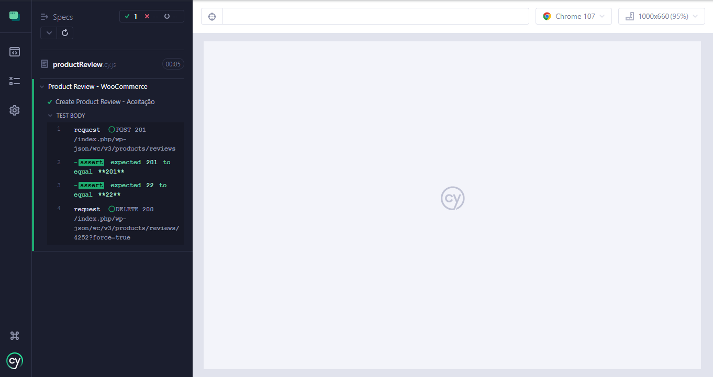
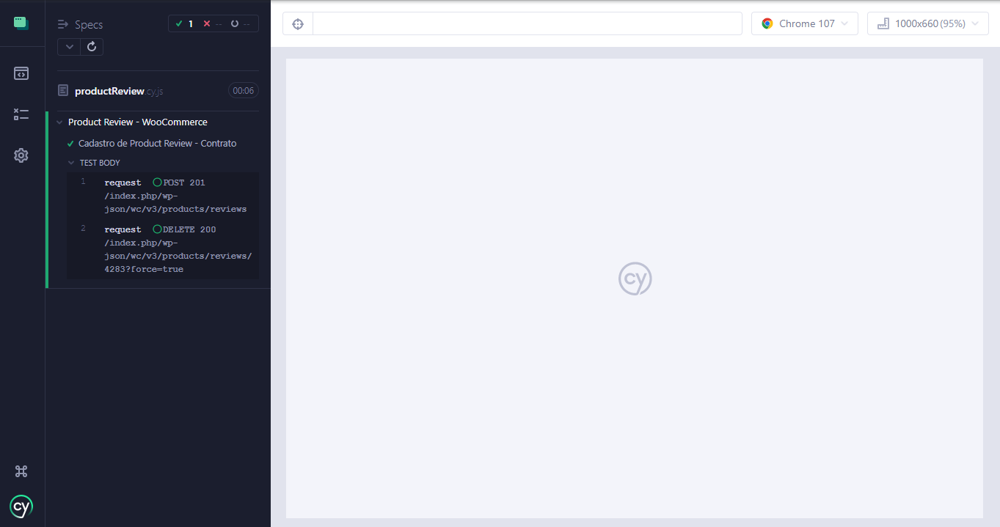
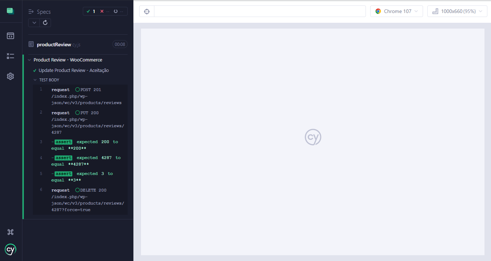
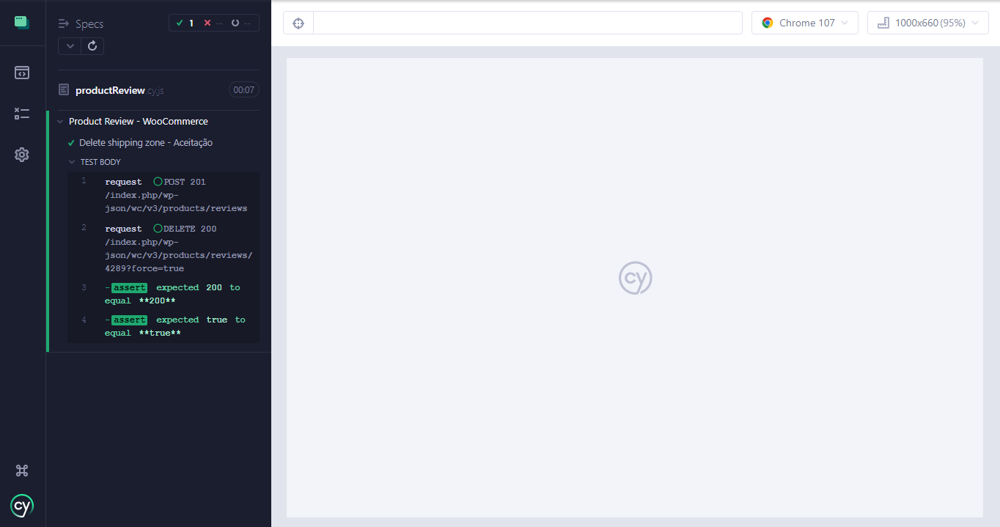

# Desafio Automação de Testes de API com Cypress
 

> Sequência de testes:
- Criar um product review com POST /products/reviews (o campo review e/ou reviewer_email precisam ser dinâmicos, o product_id utilizado pode ser 22); 

- Editar o product review criado com PUT /products/reviews/id;

- Deletar o product review criado com DELETE /products/reviews/id.
  

### [Documentação utilizada](https://woocommerce.github.io/woocommerce-rest-api-docs/#product-reviews)

 

> Método POST

 

> Contrato

 

> Método PUT

 

> Método DELETE
